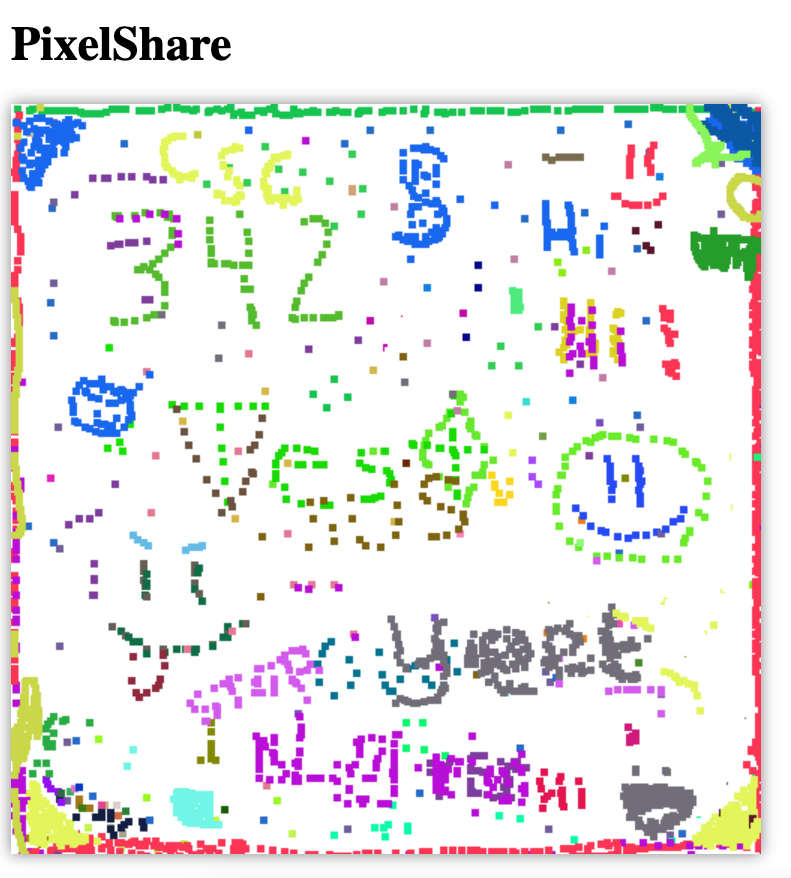

# PixelShare

> Create a shared pixel canvas.

### Workshop steps

0. Create firestore.json with appropriate credentials (available from console). Run `npm install` inside pixelshare.
1. Confirm can read values from database by running db.js and adding code for reading from `pixels` db.
2. Try draw functionality.
3. Inside index.js, write a `loadPixels()` function that reads files from db. Create web socket connection with canvas client and emit event to load data.
4. Create a web socket connection and emit event for saving drawn pixels.
5. Subscribe to changes to firestore and broadcast to canvas.

### Example class shot

